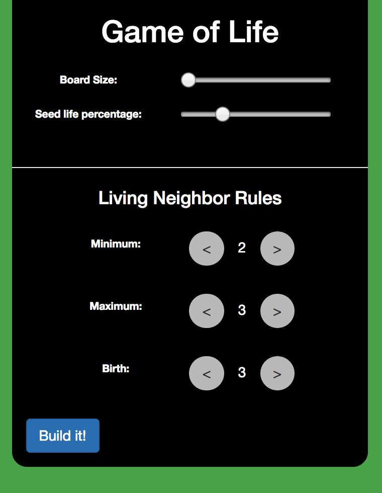

# 3D Game of Life
### Beta Version 0.1

## What this is

This game is the product of the "Hackathon" project for FullStack Academy. The original functionality was 'hacked' together over three days, by one guy: Me! I am continuing to work on the project as a means to practice JavaScript, while pursuing employment.

The beta version of the game is currently available [here.](gameoflife-3d.herokuapp.com)

Thank you for checking out the 3D Game of Life!

## What it does

Conway's Game of Life was a 2-dimensional grid of 'cells' which were either 'alive' or 'dead,' and each cell would change states each turn based on the number of their neighbors that were alive. There exist several attempts to convert Conway's version of the game into a 3-Dimensional environment, and their rules differ slightly.

This repository is an attempt to offer a number of rulesets in one easy app.

## What's next?

The initial commit for this GitHub repo was created from the results of the "Stackathon" project, mentioned above. I intend to continue implementing refactors and improvements to practice JavaScript while pursuing employment. The list of refactors is being tracked on GitHub and Waffle.io.

### To Contribute

Please feel free to fork [the repo,](https://github.com/gameoflife-3d) and do not hesitate to submit PR's, open issues, or star the repo if you have fun with it ;)

## Who am I?

I am a recent graduate of the FullStack Academy of Code remote immersive software engineering program.

Another project in which I am involved is *BiteSwipe*, a native android application, under development by a team of four FullStack Academy Alums. The GitHub page for that project can be found [here,](https://github.com/dennisdeng2002/biteswipe) and the app can be downloaded [here.](http://biteswipe.herokuapp.com/)

I would welcome any feedback, and can be contacted by email, here: hario.mark@gmail.com, or on LinkedIn, [here.](https://www.linkedin.com/in/mark-hario-6b871285/)
